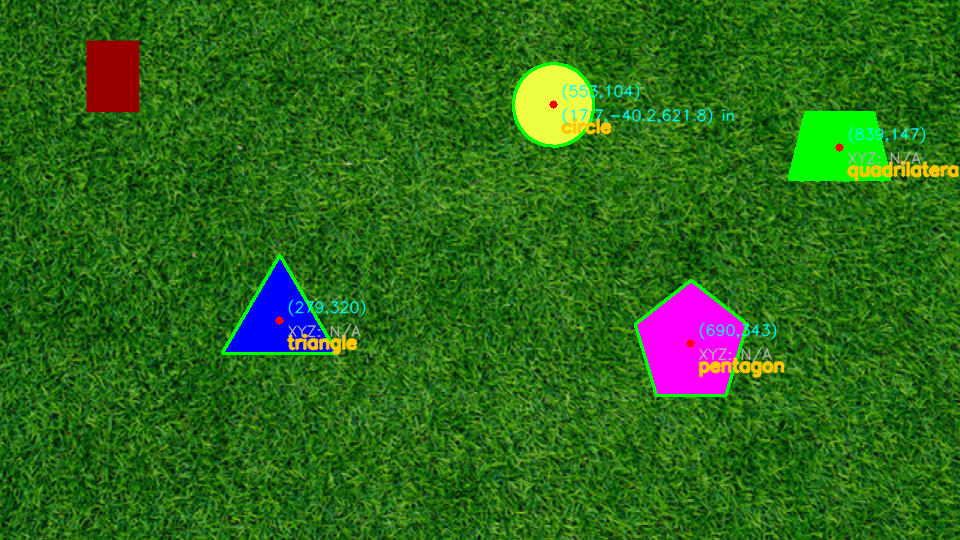

PennAiR Shape Detection Attempt — Fall 2025 Challenge
=============================================

End-to-end solution for **Parts 1–4** (with **extra credit**: background-agnostic detection and robust shape labeling). Includes runnable scripts for static images and videos, confidence scoring, shape labels, optional **3D (X, Y, Z)** for circles, a plane-Z propagation heuristic for non-circles, robust video exporting, and an H.264 transcoder for browser-friendly MP4s.

> **ROS 2 is intentionally omitted** (Part 5), per submission strategy. All source files are **fully line-commented** for review.

Table of Contents
-----------------

*   [Overview](#overview)
    
*   [Algorithms (tried to explain in English)](#algorithms-tried-to-explain-in-english)
    
*   [Project Layout](#project-layout)
    
*   [Setup (Windows/PowerShell)](#setup-windowspowershell)
    
*   [Quick Start](#quick-start)
    
    *   [Part 1: Static Image](#part-1-static-image)
        
    *   [Part 2–3: Video (Regular & Hard)](#part-23-video-regular--hard)
        
    *   [If an MP4 won’t play: Transcode to H.264](#if-an-mp4-wont-play-transcode-to-h264)
        
*   [Command-Line Reference](#command-line-reference)
    
*   [Troubleshooting](#troubleshooting)
    
*   [Known Discrepancies on the _Hard_ Video (and Mitigations)](#known-discrepancies-on-the-hard-video-and-mitigations)
    
*   [Extra Credit Implemented](#extra-credit-implemented)
    
*   [Known Limitations](#known-limitations)
    
*   [How to Submit (GitHub + Embeds)](#how-to-submit-a-basic-idea-github--embeds)
    
*   [File-by-File Guide](#file-by-file-guide)
    
*   [Tuning Tips](#tuning-tips)
    
*   [Attribution](#attribution)
    

Overview
--------

This repo detects **solid shapes** on grassy or arbitrary backgrounds, **traces outlines**, **locates centers**, assigns a **label** (circle, triangle, quadrilateral, pentagon, polygon), and computes a **confidence** score. It can overlay **3D (X, Y, Z)** for circles using a pinhole model with a known circle radius (10 in).

For video, it runs per-frame, keeps **stable IDs** with a centroid tracker, and can draw **motion trails**. MP4 export is robust; if a player refuses the MP4, a provided transcoder produces standard **H.264/yuv420p**.

Algorithms (tried to explain in English)
--------------------------

**Background-agnostic segmentation (extra credit):** Convert to **Lab**; k-means cluster (K=5 by default). Each cluster → binary mask; apply **gentle morphology (3×3)** to remove specks/close tiny gaps while preserving corners.

**Contour gating:** Keep only contours that pass:

*   **Area** ≥ min\_area (default 300 px²)
    
*   **Solidity** (area / convex-hull area) ≥ solidity\_min (default 0.85)
    
*   **Low internal texture** (mean **Sobel** gradient ≤ adaptive percentile threshold) to reject grassy regions
    

**Centers & radii:** Center from image **moments** (fallback: enclosing circle center). Radius from either the **enclosing circle** or **ellipse minor-axis / 2** (depth-friendly).

**Robust shape labeling**

1.  **Circle guard first:** multi-cue decision combining circularity (4πA/P²), fill ratio vs enclosing circle, ellipse axis ratio, and radial consistency.
    
2.  Otherwise, **polygon count on the convex hull** with **multi-epsilon approxPolyDP** and **near-collinear pruning**.
    
    *   Tie-break **prefers fewer vertices** (prevents triangles collapsing to quads on the hard video).
        
    *   A **quad→triangle rescue** collapses quads with an extra micro-edge or a near-straight interior angle.
        

**Confidence score:** Weighted blend of normalized **area**, **solidity**, and **inverse texture** (lower interior gradient = higher score).

**3D (Part 4)** Intrinsics:

```text
fx = 2564.3186869
fy = 2569.70273111
cx = 0.0
cy = 0.0
R  = 10.0 inches (true circle radius)
```

Given a detected circle pixel radius r\_px, estimate depth Z ≈ fx \* R / r\_px.Then X = (u - cx) \* Z / fx, Y = (v - cy) \* Z / fy.

**Plane-Z propagation (optional):** For visualization, reuse the latest valid circle depth to annotate **non-circles** (heuristic; not metrically guaranteed).

Project Layout
--------------

```text  
pennair-shapes-full-commented/  
├─ data/  
│  ├─ PennAir_2024_App_Static.png  
│  ├─ PennAir_2024_App_Dynamic.mp4  
│  └─ PennAir_2024_App_Dynamic_Hard.mp4  
├─ outputs/                   # generated images/videos land here  
├─ src/  
│  ├─ detector.py             # robust detection + labeling (fully commented)  
│  ├─ depth.py                # circle -> (X, Y, Z) helper (fully commented)  
│  ├─ tracker.py              # centroid tracker + EMA + trails (fully commented)  
│  ├─ run_static.py           # Part 1 runner (fully commented)  
│  ├─ run_video.py            # Part 2–3 runner; robust writers (fully commented)  
│  └─ transcode_h264.py       # H.264/yuv420p transcoder (fully commented)  
├─ requirements.txt  
└─ README.md
```

> **Note:** Only the **two challenge videos** and the **static PNG** belong in data/. You don’t need to commit generated videos unless you want to.

Setup (Windows/PowerShell)
--------------------------

```text
# 1) Open PowerShell in repo root
# 2) Create & activate venv  python -m venv .venv  .\.venv\Scripts\Activate
# 3) Install dependencies  pip install --upgrade pip  pip install -r requirements.txt
# 4) Ensure outputs/ exists  if (!(Test-Path outputs)) { mkdir outputs }
```

> **PowerShell line wrap:** end a line with a backtick \` to continue on the next line.

Quick Start
-----------

### Part 1: Static Image

**Minimal (labels + centers + outlines):**

```text
python src\run_static.py --in data\PennAir_2024_App_Static.png `
--out outputs\static_annotated.png
```

**Add (X, Y, Z) for circles (ellipse radius recommended):**

```text
python src\run_static.py --in data\PennAir_2024_App_Static.png `
--out outputs\static_annotated.png --annotate_xyz --ellipse_radius
```

**Plane-Z propagation (heuristic; annotate non-circles too):**

```text
python src\run_static.py --in data\PennAir_2024_App_Static.png `
--out outputs\static_annotated_plane.png --annotate_xyz `
--ellipse_radius --propagate_plane_z
```

### Part 2–3: Video (Regular & Hard)

**Regular dynamic video:**

```text
python src\run_video.py --in data\PennAir_2024_App_Dynamic.mp4 `
--out outputs\dynamic_annotated.mp4 --annotate_xyz --draw_trails `
--ellipse_radius --propagate_plane_z
```

**Hard dynamic video:**

```text   
python src\run_video.py --in data\PennAir_2024_App_Dynamic_Hard.mp4 `
--out outputs\dynamic_hard_annotated.mp4 --annotate_xyz --draw_trails `
--ellipse_radius --propagate_plane_z
```

You’ll see progress messages like \[progress\] Processed 300 frames…. Outputs appear in outputs/.

### If an MP4 won’t play: Transcode to H.264

Install (once):

`   pip install imageio imageio-ffmpeg   `

**Regular dynamic → H.264:**

```text
python src\transcode_h264.py --in outputs\dynamic_annotated.mp4 `
--out outputs\dynamic_annotated_h264.mp4
```

**Hard dynamic → H.264:**

```text   
python src\transcode_h264.py --in outputs\dynamic_hard_annotated.mp4 `
--out outputs\dynamic_hard_annotated_h264.mp4
```

> Optional: force a specific FPS (e.g., --fps 30) if your player is picky.

If your MP4 is **tiny/corrupt** (e.g., “moov atom not found”), regenerate with an **AVI fallback** and transcode the AVI:

```text
python src\run_video.py --in data\PennAir_2024_App_Dynamic.mp4 `
--out outputs\dynamic_annotated.mp4 --annotate_xyz --draw_trails `
--ellipse_radius --propagate_plane_z --also_avi  python src\transcode_h264.py --in outputs\dynamic_annotated.avi `
--out outputs\dynamic_annotated_h264.mp4
```

Command-Line Reference
----------------------

### run\_static.py

| Flag                  |    Type |      Default | Description                                    |
| --------------------- | ------: | -----------: | ---------------------------------------------- |
| `--in`                |   `str` | **required** | Input image path                               |
| `--out`               |   `str` | **required** | Output image path                              |
| `--K`                 |   `int` |          `5` | k-means clusters (Lab space)                   |
| `--min_area`          |   `int` |        `300` | Min component area (px²)                       |
| `--solidity_min`      | `float` |       `0.85` | Area / convex-hull area                        |
| `--ellipse_radius`    |  `flag` |          off | Use ellipse minor-axis / 2 for radius          |
| `--annotate_xyz`      |  `flag` |          off | Overlay (X, Y, Z) for circles                  |
| `--propagate_plane_z` |  `flag` |          off | Heuristic: reuse last circle-Z for non-circles |


### run\_video.py

| Flag                  |    Type |      Default | Description                         |
| --------------------- | ------: | -----------: | ----------------------------------- |
| `--in`                |   `str` | **required** | Input video path                    |
| `--out`               |   `str` | **required** | Output MP4 path                     |
| `--K`                 |   `int` |          `5` | k-means clusters                    |
| `--min_area`          |   `int` |        `300` | Min area (px²)                      |
| `--solidity_min`      | `float` |       `0.85` | Solidity threshold                  |
| `--ellipse_radius`    |  `flag` |          off | Ellipse minor-axis / 2 for radius   |
| `--annotate_xyz`      |  `flag` |          off | Write (X, Y, Z) inches              |
| `--draw_trails`       |  `flag` |          off | Draw motion trails                  |
| `--also_avi`          |  `flag` |          off | Also export `.avi` (MJPG)           |
| `--max_frames`        |   `int` |         `-1` | Process only N frames; `-1` = all   |
| `--max_dist`          | `float` |       `60.0` | Tracker association gate (px)       |
| `--max_lost`          |   `int` |         `10` | Frames to keep unmatched track      |
| `--ema_alpha`         | `float` |        `0.5` | EMA smoothing for centers/radius    |
| `--trail`             |   `int` |         `20` | Trail length (points)               |
| `--propagate_plane_z` |  `flag` |          off | Reuse last circle-Z for non-circles |
| `--h264`              |  `flag` |          off | Write H.264 directly with imageio   |


Troubleshooting (things that I have encountered personally are here as well)
---------------

**“moov atom not found” / MP4 won’t open**

*   Get-ChildItem outputs | Format-Table Name,Length -Auto
    
*   Re-run run\_video.py. If MP4 is tiny, add --also\_avi and **transcode the AVI**.
    

**Video plays locally but not on GitHub**

*   Always transcode to **H.264/yuv420p** (transcode\_h264.py). Some players reject other pixel formats/codecs.
    

**Imports didn’t update after edits**

`   if (Test-Path src\__pycache__) { Remove-Item -Recurse -Force src\__pycache__ }   `

**PowerShell multi-line commands**

*   Put a backtick at the **end** of the wrapped line. Don’t leave stray backticks.
    

**Path confusion**

`   Get-Location   `

Known Discrepancies on the _Hard_ Video (and Mitigations)
---------------------------------------------------------

**Observed:**

*   The **triangle** can sometimes be labeled a **quadrilateral** (spurious micro-corner).
    
*   The **pentagon** can wobble between pentagon and quadrilateral under blur.
    
*   The **circle** is generally stable but may occasionally read polygon in heavy blur.
    

**Why:**High texture, blur, and perspective produce tiny artifacts after segmentation. Since labeling is per-frame (stateless), small frame-to-frame differences can flip the name.

**Mitigations already in src/detector.py:**

*   Polygon counting on the **convex hull**
    
*   **Multi-epsilon** approxPolyDP + **near-collinear pruning**
    
*   Tie-break **prefers fewer vertices** (protects triangles)
    
*   **Quad→triangle rescue** (shortest-edge or near-straight-angle collapse)
    
*   **Circle guard** before polygon counting
    

**If triangle→quad flips persist**, harden two thresholds (then clear \_\_pycache\_\_ and re-run):

*   \_stable\_poly\_approx(..., angle\_keep=165.0) → 160.0 (prune more near-straight corners)
    
*   \_maybe\_collapse\_quad\_to\_triangle: increase short\_edge\_ratio (e.g., 0.22 → 0.25) or lower max\_angle (e.g., 168.0 → 165.0)
    

**Production-grade fix (optional):**Stabilize **labels** in the **tracker** (majority vote per track). Detector stays stateless; the tracker owns temporal smoothing.

Extra Credit Implemented
------------------------

*   **Background-agnostic**: Lab k-means + adaptive Sobel texture gate
    
*   **Robust labeling**: circle guard; hull-based multi-epsilon polygon counting; collinear pruning; quad→triangle rescue
    
*   **3D for circles**: pinhole back-projection with given intrinsics and R=10 in
    
*   **Plane-Z propagation**: optional Z for non-circles (visual aid)
    
*   **Robust exporting**: MP4 writer, optional AVI fallback, and a bundled H.264/yuv420p transcoder
    

Known Limitations
-----------------

*   Depth assumes **flat ground**, **cx=cy=0** per prompt, and no lens distortion.
    
*   Non-circle depths via plane-Z propagation are **heuristic** (visual aid only).
    
*   Per-frame labels may flicker without tracker-level label smoothing.
    
*   k-means has minor randomness even with K-Means++; multiple attempts reduce variance but don’t eliminate it.
    

How to Submit: A very Basic Idea (GitHub + Embeds)
-------------------------------

Initialize and push:

```text
git init
git add .
git commit -m "PennAiR shapes solution (Parts 1–4 + extras)"
git branch -M main
git remote add origin https://github.com//pennair-shapes.git
git push -u origin main
```

Embed media in README.md (GitHub may not autoplay; links still work):

```text
## Results
### Static (annotated)  
### Static with plane-Z  
### Dynamic (H.264)    [Download the video](outputs/dynamic_annotated_h264.mp4)
### Dynamic — Hard (H.264)    [Download the video](outputs/dynamic_hard_annotated_h264.mp4)
```

File-by-File Guide
------------------

*   **src/detector.py** — Detection pipeline: Lab k-means → gentle morphology → contour gates (area/solidity/texture) → center & radius → **robust labeling** (circle guard + hull polygon count + collinear pruning + quad→triangle rescue) → confidence → drawing.
    
*   **src/depth.py** — Circle (u, v, r\_px) → (X, Y, Z) in inches; Z ≈ fx \* R / r\_px, X = (u - cx) \* Z / fx, Y = (v - cy) \* Z / fy.
    
*   **src/tracker.py** — Lightweight centroid tracker with EMA smoothing, stable IDs, and motion trails.
    
*   **src/run\_static.py** — Part 1 runner (PNG/JPG). Flags: --annotate\_xyz, --ellipse\_radius, --propagate\_plane\_z.
    
*   **src/run\_video.py** — Per-frame detection + tracking + overlays, robust writers (MP4 + optional AVI), progress logging, frames fallback.
    
*   **src/transcode\_h264.py** — Produces **H.264/yuv420p** with -movflags +faststart for web playback (uses imageio-ffmpeg).
    
*   **requirements.txt** — opencv-python, numpy, imageio, imageio-ffmpeg, etc.
    

Tuning Tips
-----------

*   **Hard video sturdiness**:
    
    *   \_stable\_poly\_approx(..., angle\_keep=165.0) → 160.0
        
    *   \_maybe\_collapse\_quad\_to\_triangle: short\_edge\_ratio 0.22 → 0.25, max\_angle 168.0 → 165.0
        
*   **Speed vs accuracy**: lower K (e.g., 4) or raise min\_area.
    
*   **Tracker smoothness**: lower --ema\_alpha (steadier centers), raise --max\_lost (longer persistence).
    
*   **Depth stability**: use --ellipse\_radius for steadier Z on slightly elliptical projections.
    

Attribution
-----------

*   OpenCV (BSD-3), NumPy (BSD-3), ImageIO (BSD-2), imageio-ffmpeg (BSD-2).
    
*   Challenge description & media: PennAiR Software Team (Fall 2025).
    

> Pro-tip: if you edit detector thresholds, **delete** src/\_\_pycache\_\_/ before re-running so Python picks up your changes.
